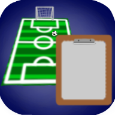

# Tborad
English|[中文](readme_cn.md)

# Explain
Made a soccer tactical board with Godot3.Through Tborad, it is more convenient to generate graphics in a football match and can also be used for tactical adjustments during halftime.

# Requirements
so, Microsoft fxxk!Due to the forced update of Windows during editing, several files were lost and are currently in the unusable demo stage. In the future, we plan to support the following formats:

* Android
* linux
* windows
* html5